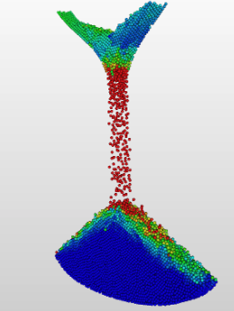

# Particle Simulation by Brownian Motion

### Overview:

To help physics understand particles's movement, I built this program for them to stimulate particles by the postions, accerlations,
number of electrons,... I was insprised by my visit to CERN (European Organization for Nuclear Research) in Switzerland where I had a chance
to see scientists studying the amazing elements that created our own world.

This is a sample stimulation



This is a picture I took at CERN, Geneva, Switzerland


### Usage:
To use our program, compile and run, and fill in the information when prompted. See example below:

```
$ javac *.java
$ java Box
How many particles do you want to have?
500000
What is the initial speed (kilometers per second)?
2200
Do you want to add more options?
Yes
```

Contact: https://www.linkedin.com/in/duyngp/
